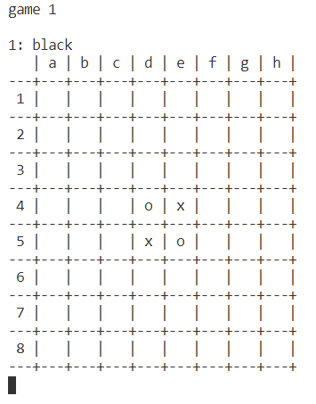

# Gym環境におけるリバーシAI  
以下のライブラリを応用してリバーシAIを作りました.  
https://github.com/TadaoYamaoka/creversi  
https://github.com/TadaoYamaoka/creversi_gym  

WindowsとGoogle Colaboratoryでのみ動作確認済.  
なお、OpenAI Gym(Google Colabの場合不要)とCythonのインストールが必要.  

## How to use  
1. Google Colabの場合はGoogle Driveのマウントを行う.  
1. creversi/とcreversi_gym/でそれぞれ`pip install -e .`を実行.  
1. 以下のLearning, Game Playへと進む.

## Learning  
creversi_gym/creversi_gymにあるdqn.py, dqn_parallel.py, dqn_per.pyの中から学習させたいモデルを選択. オプションにより保存する学習データ名やイテレーション数などの変更が可能.  

### 各モデルの説明  
- dqn.py
    - バニラDQN.  
- dqn_parallel.py  
    - 環境を並列化したDQN.
    - DDQN, Duelingも可能.  
- dqn_per.py
    - 優先順位付き経験再生を用いたDQN.  
    - DDQN, Duelingも可能.  

### オプションの説明  
- `--ddqn`: DDQNで学習する. (dqn_parallel.py, dqn_per.py)  
- `--dueling`: Dueling Networkで学習する. (dqn_parallel.py, dqn_per.py)  
- `--model`: 保存する学習データ名. デフォルトは'model.pt'.  
- `--resume`: 続きから学習する.  
- `--batchsize`: バッチサイズを指定. デフォルトは256.  
- `--num_episodes`: 学習エピソード数を指定. デフォルトは160000. (dqn.py)  
- `--num_iterations`: 学習イテレーション数を指定. デフォルトは10000. (dqn_parallel.py, dqn_per.py)  
- `--log`: ログデータを指定したファイルに保存する.

## Game play
`creversi_gym/creversi_gym/gameplay.py`を実行することでゲーム開始.  

### オプションの説明
- `player1`, `player2`: 'random', 'greedy', 'softmax', 'human'から選択. player1が先攻, 黒色.  
- `--model1`: player1に使用する学習データ. デフォルトは'model.pt'
- `--model2`: player2に使用する学習データ.  
- `--network1`, `--network2`: 'dqn', 'dueling'からplayer1, player2に使用するモデルを選択. デフォルトは'dqn'.  
- `--temperature`: softmaxを使用する際の温度. デフォルトは0.1.  
- `--games`: 試合数. デフォルトは1.  
- `--is_display`: 盤面を表示.  

### コマンド  
例えばcreversi_gym/creversi_gymにおいて`python gameplay.py human human --is_display`を実行すれば画像のような盤面が表示される. ここで, 'o'は白, 'x'は黒を表している.  

  

このとき入力できるコマンドは  
- `c4`や`f6`のように石を置く.  
- `resign`で降参.  
- `quit`で中止.  
- `undo`で1つ前の自分の番に戻る.  
